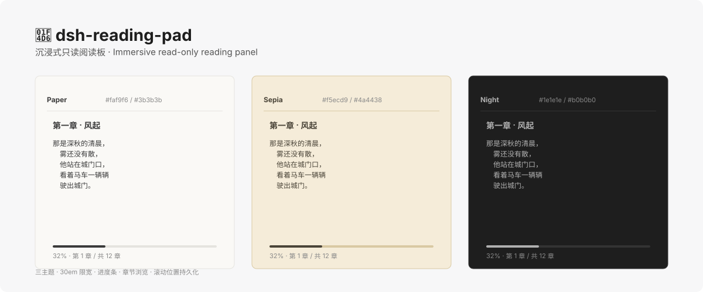

<p align="center">
  
</p>

<h1 align="center">dsh-reading-pad</h1>

<p align="center">
  <strong>An immersive read-only reading panel for DeepSeek Harness</strong> —— the model pushes a typeset Markdown into your right sidebar, or you flip through the chapters of your current writing project.
</p>

<p align="center">
  <a href="https://github.com/shengyvself/dsh-reading-pad/releases">
    
  </a>
  <a href="https://github.com/shengyvself/dsh-reading-pad">
    
  </a>
  
  
  
</p>

<p align="center">
  <a href="./README.md">中文</a> · <strong>English</strong>
</p>

<p align="center">
  <a href="assets/hero.svg">
    
  </a>
</p>

## What you get

- 📖 **AI-delivered prose** —— ask the model to push a typeset Markdown through `reading_pad_send` and read it in the panel; the text is rendered as-is, zero processing.
- 📚 **Manuscript chapters** —— switch to the "Manuscript" mode and flip through the chapters of your current writing project, without opening the writing workspace.
- 🎨 **Three low-blue-light themes** —— Paper (warm white) / Sepia (cream) / Night (dark grey), one-click switch, your choice is remembered.
- 📐 **30em measure typography** —— line width fixed at 30em (about 30 Chinese characters), line-height 1.6, 2em first-line indent, 0.8em paragraph gap —— designed after a printed book's rhythm, easy on the eyes.
- 🔤 **A⁻ / A⁺ font sizing** —— zoom between 16 and 20px, reflows automatically.
- 📊 **Progress bar + chapter browser** —— a thin bar shows where you are in the current chapter; the "Next chapter" button at the end of the chapter never auto-jumps (avoids accidental paging); first and last chapters grey out.
- 💾 **Scroll position persistence** —— close the tab and reopen it, you continue exactly where you stopped.
- 🔔 **New-content badge** —— when the AI delivers a new draft and the tab is unfocused, the tab title shows a "New" badge without stealing focus.

## Install

```sh
dsh plugin --profile web add dsh-reading-pad
```

After installing, **restart `dsh web`**, then open the right sidebar → add the "📖 Reading Pad" tab from the "+" menu.

**Requires DSH 0.1.5-rc.5 or newer.** Uses the official native right-sidebar keyed slots (`sidebar.right.pane.tab`), **no dependency** on `dsh-better-sidebar`.

You can also install directly from GitHub (skipping npm):

```sh
dsh plugin --profile web add github:shengyvself/dsh-reading-pad
```

## What you can do with it

After installing, just talk to the agent:

- "Push this draft to the reading pad" —— the AI calls `reading_pad_send` to deliver the typeset Markdown
- "Read chapter one" —— switch to the "Manuscript" mode and open the first chapter of your current writing project
- "Switch to Night theme" —— flip to the dark low-blue-light mode
- "Bump the font up a bit" —— press A⁺ to enlarge

The panel never acts on its own; it only shows content when you or the AI trigger it.

## Content sources

| Source | How |
|---|---|
| **AI-delivered prose** | The AI calls the `reading_pad_send` tool → the panel displays it. Typesetting is the AI's job; the panel renders as-is. |
| **Manuscript chapters** | The client reuses the writing module's existing HTTP RPC (`/api/writing/workspaceIndex` and `/api/writing/chapterText`) to read the current writing project's chapter list and full text. |

Outline / lore / drafting-pad drafts are phase-2 placeholders (greyed out).

## Compatibility

| Use case | DSH version | Plugin version |
|---|---|---|
| **Recommended** | **`0.1.5-rc.5+`** | **`0.1.0`** |

Installing the plugin **does not** upgrade the host DSH. If you are on an older DSH version (`0.1.0-rc.*` or earlier), the native right-sidebar keyed slots may not exist yet —— the tab won't appear in the "+" menu. Upgrade DSH to fix.

## Security

The reading pad is a **read-only consumer**, with explicit boundaries:

- Writes only the local plugin state file (`~/.dsh/<state>.json`, session display text + history ≤20 FIFO); never touches canon / creative files.
- No heavy third-party Markdown renderer. Rendering is a pure front-end M1 subset (headings / paragraphs / bold-italic / strikethrough / inline code / links-images / single-level lists / blockquote / hr / fenced code blocks / GFM tables); HTML is escaped, URLs restricted to `http` / `https` / relative paths.
- No network calls. Except for reusing the host's existing `/api/writing/*` HTTP RPC, there are no outbound requests.

Full policy: [`SECURITY.md`](./SECURITY.md).

## Dependency notes

Server-side dependencies (`@deepseek-ai/dsh-tools`, `@deepseek-ai/dsh-typert-protocol`) are declared in `peerDependencies` —— provided by the host DSH, never written to `dependencies` (avoids manifest shadowing the host version). Client-side packages also go through `peerDependencies` (cordis / dsh-client-* / react).

Since v0.1.0 the panel is **decoupled from `dsh-better-sidebar`**: it registers to the official native keyed slots (`sidebar.right.pane.tab` + `.title`) via `ctx.sidebarRightTabs.register` (two-step registration).

## Build

```bash
node scripts/build.mjs   # server-side ESM copy + client esbuild to browser CJS (ModuleLoader wrapper, id=dsh-reading-pad)
```

## Development

See [`CONTRIBUTING.md`](./CONTRIBUTING.md), [`ARCHITECTURE.md`](./ARCHITECTURE.md), [`CHANGELOG.md`](./CHANGELOG.md).

## License

[Apache License 2.0](./LICENSE) © shengyvself
